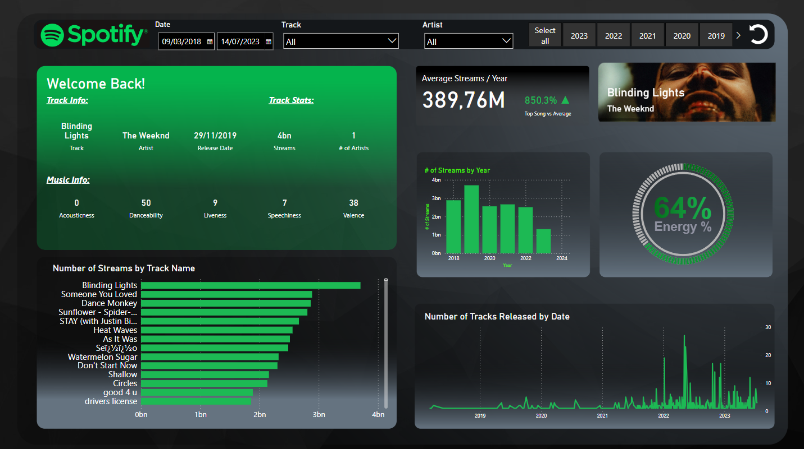

# Spotify Analytics Dashboard

## Overview

This repository contains a Spotify Analytics Dashboard created with Power BI. The dashboard provides detailed insights into music streaming patterns, track information, artist statistics, and trends over time.

## Features

- **Track Information**: Displays information about a specific track including artist name, release date, and total streams.
- **Music Information**: A breakdown of the track's musical characteristics such as acousticness, danceability, liveness, speechiness, and valence.
- **Streaming Data**: Graphical representation of the number of streams per track, categorized by track name.
- **Historical Analysis**: A bar chart showing the number of streams by year, illustrating trends and popularity over time.
- **Energy Level**: A gauge indicating the energy percentage of the currently selected track.

## Data

The data for this dashboard is sourced from Spotify's Web API, which provides detailed information about tracks, artists, and user listening habits.

## Usage

To use the dashboard:

1. Clone this repository to your local machine.
2. Navigate to the `artifacts` folder.
3. Open the `dashboard.pbix` file with Power BI Desktop.

## Requirements

- Power BI Desktop
- An internet connection to fetch the latest data from Spotify's Web API.

## Contributions

If you would like to contribute to this project or suggest improvements, please submit a pull request or open an issue.

## License

This project is open source and available under the [MIT License](LICENSE).

---

For more information, please contact the repository owner.
